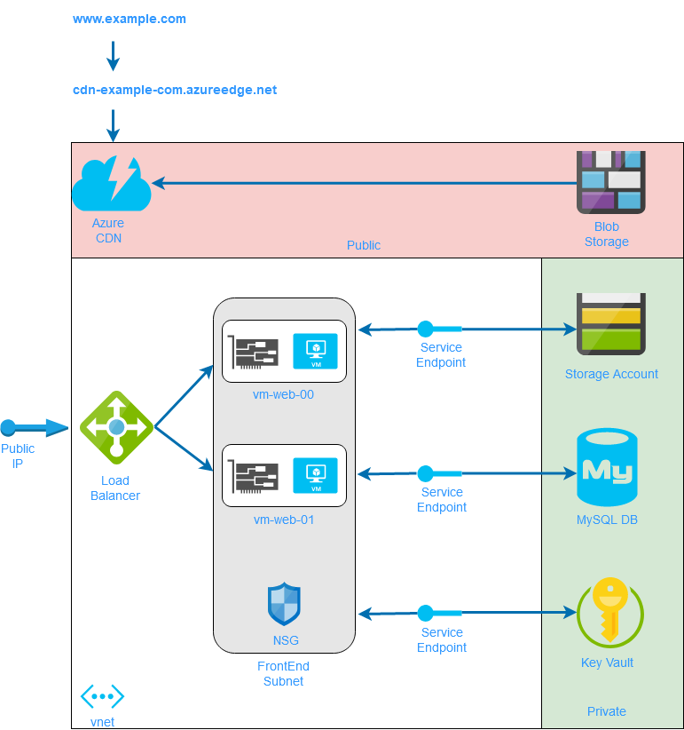

# terraform-samples
### Sample configurations for Azure and AWS developed in my quest to learn Terraform

The **examples** folder contains stand alone configurations that can be deployed individually. For instance:

**az-vnet** deploys de following Azure resources:
* 1 x resource group, 1 x virtual network with one subnet, 1 x network security group associated with the subnet

**az-vm** deploys the following Azure resources:
* 2 x VMs running Ubuntu, 2 x public IPs associated with VMs, 2 x custom script VM extensions that install Azure CLI, etc.
 
To deploy an example just fill in your values for the input parameters in the corresponding **terraform.tvars** file and from the folder run:

```
$ terraform init

$ terraform plan

$ terraform apply
```
The **modules** folder contains child modules that can be invoked to build consistent environments. There are four modules there for now: **network**, **web** , **data**, and **global**.

The **environments** folder contains root modules that build different environments by invoking the same child modules. 
The only differences between the **dev** and **stage** environments are the values of the input parameters injected into the child modules. The child modules themselves use the same code!

The environment architecture diagram is below:


## Resources
[CloudSkills Github Repository](https://github.com/cloudskills)

[How to create reusable infrastructure with Terraform modules](https://blog.gruntwork.io/how-to-create-reusable-infrastructure-with-terraform-modules-25526d65f73d)
